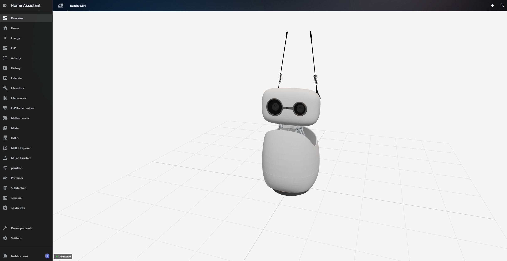

# Reachy Mini 3D Card

A custom Lovelace card that provides real-time 3D visualization of the Reachy Mini robot.



## Features

- 🤖 Real-time 3D robot visualization at 20Hz
- 🔄 WebSocket connection with HTTP polling fallback
- 🎮 Interactive camera controls (rotate, zoom)
- 📊 Connection status indicator
- 🎨 Configurable appearance and behavior
- 🔧 Visual configuration editor

## Quick Start

Use My Home Assistant one-click import:
[Add repository to HACS](https://my.home-assistant.io/redirect/hacs_repository/?owner=ha-china&repository=ha-reachy-mini-card&category=plugin)

1. Install via HACS
2. Add the card to your dashboard
3. Configure daemon host and port
4. **Important**: Clear browser cache after installation

## Basic Configuration

```yaml
type: custom:ha-reachy-mini-card
daemon_host: 192.168.1.100
daemon_port: 8000
```

## ⚠️ Important: Clear Browser Cache

After installation or updates, you **must** clear your browser cache:

- **Chrome/Edge**: `Ctrl+Shift+Delete` → Select "Cached images and files"
- **Firefox**: `Ctrl+Shift+Delete` → Select "Cache"
- **Safari**: `Cmd+Option+E`

Then hard refresh: `Ctrl+F5` (Windows) or `Cmd+Shift+R` (Mac)

## Troubleshooting

If you see 404 errors for 3D assets:
1. Clear browser cache (see above)
2. Hard refresh the page
3. Restart browser
4. Check browser console errors and installation guide details

## Requirements

- Home Assistant 2024.11.0+
- Reachy Mini daemon running and accessible

## Documentation

- [Full README](https://github.com/ha-china/ha-reachy-mini-card)
- [HACS Installation Guide](https://github.com/ha-china/ha-reachy-mini-card/blob/main/HACS_INSTALLATION.md)
- [Configuration Options](https://github.com/ha-china/ha-reachy-mini-card#configuration-options)
